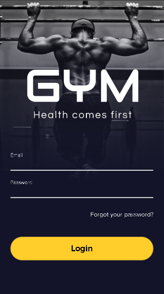
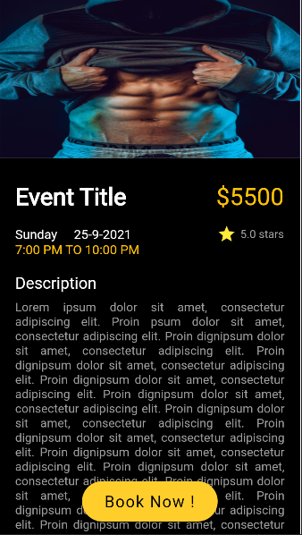
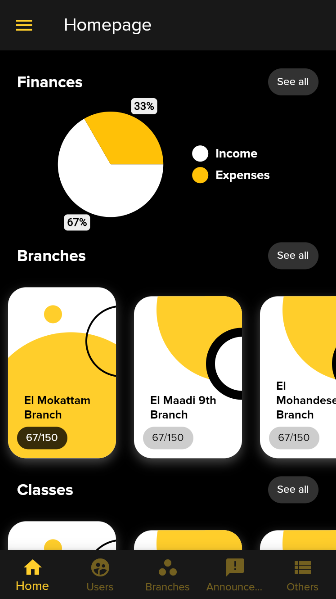
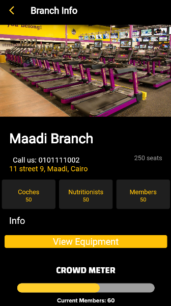
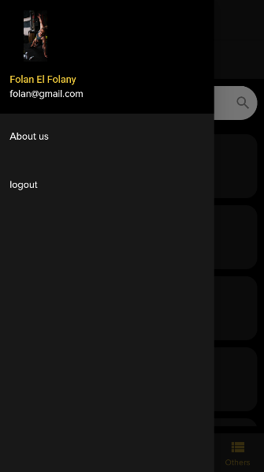
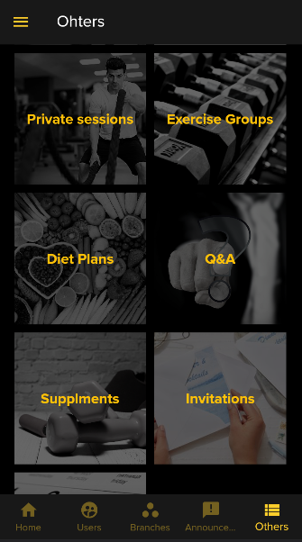
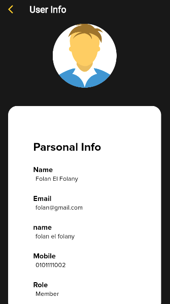
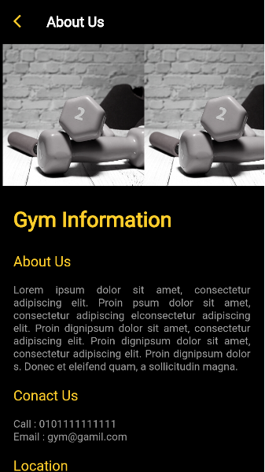

# GymProject
NajahNow internship making a gym template application backend with laravel &amp; frontend w mobile with flutter 

## Table of Contents

* [Description](#description)
* [Technologies](#technologies)
* [Screenshots](#screenshots)
* [Footer](#footer)

## Description

A web-based information system that automates an existing gym system. Through the app the admin can manage the different types of users (member, trainer and nutritionist). Each role in the system can participate thier normal responsibilities. the gym member can see all the details about the gym in real time. A trainer can arrange a session with one member or more. the nutritionist can put different diet plans for memebrs to follow.

## Technologies

    

## Screenshots

    

     

    

## Footer
Dont forget to leave a star if you like the repository. 😉
check my [profile](https://github.com/AdhamMagdyA) for more repositories. 🤩
